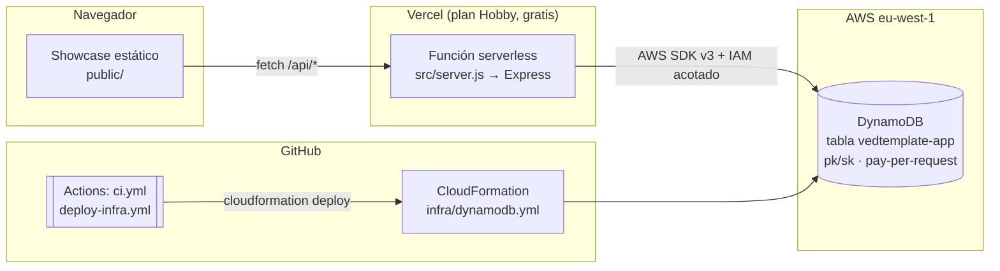

# 🧩 vedtemplate — Plantilla: Vercel + Express + DynamoDB

[](https://github.com/infranettone/infranettone-template-vercel-express-dynamodb/actions/workflows/ci.yml)
**Demo en producción:** https://vedtemplate.infranettone.com

Todos los recursos de esta instancia llevan el prefijo **vedtemplate**: stack CloudFormation y
tabla DynamoDB `vedtemplate-app`, usuarios IAM `vedtemplate-app-deploy` (pipeline) y
`vedtemplate-app-vercel` (runtime).

Plantilla **productiva y totalmente funcional** para nuevas apps: un solo repo con frontend
estático, API Express, infraestructura como código (CloudFormation) y CI (GitHub Actions),
desplegable **gratis en Vercel** y conectada a **DynamoDB en tu cuenta AWS**.

La propia app desplegada es un **showcase autoexplicativo**: al entrar en la web ves la
arquitectura con diagramas, el estado en vivo de todas las conexiones (con latencia real a
DynamoDB), una demo CRUD contra la base de datos, la guía de despliegue paso a paso y la
documentación de la API y los tests.

## Arquitectura



**Principios:**

- **Un solo deploy** — Express sirve también el frontend: cero CORS en producción, un pipeline.
- **Fallback sin AWS** — sin credenciales la app corre en "modo memoria". Puedes desplegar y ver
  todo funcionando *antes* de crear la infraestructura; el panel de estado indica el modo activo.
- **Mínimo privilegio** — dos usuarios IAM separados: el de Vercel solo lee/escribe la tabla; el
  del pipeline solo despliega el stack.
- **Single-table design** — una tabla `pk/sk`; el prefijo de `pk` discrimina la entidad
  (`ITEM`, …). Entidad nueva = prefijo nuevo en `src/config/dynamo.js` + un servicio. La infra no cambia.
- **Coste 0 en reposo** — Vercel Hobby + DynamoDB on-demand + Actions gratis.

## Estructura

```
├── src/
│   ├── server.js            # Entry point: exporta app (Vercel) o hace listen (local)
│   ├── app.js               # Express: middleware (incl. auditoría), estáticos, rutas, errores
│   ├── config/dynamo.js     # Cliente único DynamoDB + prefijos de clave + isDynamoEnabled()
│   ├── routes/              # items (CRUD), status (health), traffic (monitorización)
│   └── services/            # Lógica: DynamoDB con fallback a memoria
│       ├── itemsService.js
│       ├── statusService.js
│       └── trafficService.js  # Captura, redacción de sensibles, bots, agregados
├── public/                  # Showcase (HTML + CSS + JS vanilla, diagramas Mermaid)
│   ├── js/track.js          # Beacon de fingerprint (identificación de visitantes)
│   ├── js/traffic.js        # Dashboard de tráfico (gráficos SVG)
│   ├── robots.txt · sitemap.xml · og.svg   # SEO
├── infra/dynamodb.yml       # CloudFormation: tabla con TTL, PITR y DeletionPolicy: Retain
├── scripts/
│   ├── setup-aws.sh         # Crea usuario IAM runtime (Vercel) acotado a la tabla
│   ├── setup-github-secrets.sh  # Crea usuario IAM deploy y sube secretos con gh
│   └── seed.js              # Registros de ejemplo
├── tests/app.test.js        # node:test contra la app real (modo memoria, sin AWS)
├── .github/workflows/
│   ├── ci.yml               # npm test en cada push/PR (sin secretos)
│   └── deploy-infra.yml     # Despliega el stack cuando cambia infra/** o a demanda
├── api/index.js             # Entrada serverless en Vercel: exporta src/app.js
└── vercel.json              # public/ estático por CDN; el resto → función /api
```

## Despliegue paso a paso

1. **Local** (sin nada externo):
   ```bash
   npm install && npm test && npm run dev   # http://localhost:3000
   ```
2. **GitHub** — crea el repo **manualmente** (en [github.com/new](https://github.com/new) o con
   `gh repo create usuario/mi-app --public --source . --push`) y haz push. `ci.yml` pasa en verde
   sin secretos.

   > 💡 **Repo de tipo plantilla**: puedes marcar este repo como *Template repository*
   > (Settings → General → Template repository). Los repos generados con "Use this template"
   > copian todo, incluidos los workflows de CI, que funcionan con normalidad. Lo único que
   > **no se copia son los secretos**: en cada repo generado hay que repetir el paso 4
   > (`setup-github-secrets.sh`) y, si quieres tabla propia, cambiar `STACK_NAME`/`TABLE_NAME`
   > en `deploy-infra.yml` para no compartir la misma tabla entre apps.
3. **Vercel** — importa el repo en [vercel.com/new](https://vercel.com/new). Publica ya, en modo memoria.
4. **Infra AWS**:
   ```bash
   ./scripts/setup-github-secrets.sh --profile miperfil --repo usuario/repo
   gh workflow run deploy-infra.yml
   # o a mano: aws cloudformation deploy --template-file infra/dynamodb.yml --stack-name vedtemplate-app
   ```
5. **Conectar Vercel a la tabla**:
   ```bash
   ./scripts/setup-aws.sh --profile miperfil
   # pega las 4 variables en Vercel → Settings → Environment Variables → redeploy
   ```
6. **Seed opcional**: `cp .env.example .env` (mismas credenciales) y `npm run seed`.

## Despliegue 100% por CLI (flujo real usado para esta instancia)

Esta instancia se desplegó entera desde terminal, sin pasar por las webs salvo dos
autorizaciones OAuth de un solo clic. Comandos reales, en orden:

```bash
# 0) Herramientas (una sola vez)
#    gh:     binario oficial en ~/.local/bin (no necesita sudo) + `gh auth login`
#    vercel: npm install -g vercel  (hace login por device-code al primer uso)

# 1) Repo en GitHub (público) y marcado como template
gh repo create infranettone/infranettone-template-vercel-express-dynamodb \
  --public --source . --push
gh api -X PATCH repos/OWNER/REPO -f is_template=true

# 2) Proyecto en Vercel + primer deploy a producción
vercel link --yes --project <nombre-proyecto>
vercel deploy --prod --yes

# 3) La protección de despliegues viene ACTIVADA por defecto (la web pide
#    login de Vercel). Se desactiva por API para hacerla pública:
#    PATCH https://api.vercel.com/v9/projects/<projectId>?teamId=<teamId>
#    body: {"ssoProtection": null}

# 4) Auto-deploy en cada push: instalar la GitHub App de Vercel en la org
#    (única parte manual: https://github.com/apps/vercel) y luego:
vercel git connect --yes

# 5) Infra AWS: usuario IAM del pipeline + secretos + stack
./scripts/setup-github-secrets.sh --profile <perfil> --repo OWNER/REPO
gh workflow run deploy-infra.yml && gh run watch

# 6) Credenciales runtime y variables en Vercel (sin tocar el dashboard)
./scripts/setup-aws.sh --profile <perfil>
printf 'eu-west-1'        | vercel env add AWS_REGION production
printf 'vedtemplate-app'  | vercel env add DYNAMODB_TABLE production
printf '<KEY_ID>'         | vercel env add AWS_ACCESS_KEY_ID production
printf '<SECRET>'         | vercel env add AWS_SECRET_ACCESS_KEY production --sensitive
vercel redeploy <url-del-último-deploy>

# 7) Dominio propio
vercel domains add vedtemplate.infranettone.com
```

**Gotchas aprendidos en el camino** (ya corregidos en la plantilla):

- Node 20 (el de Actions) no expande globs en `node --test`: usa rutas explícitas.
- Vercel trunca el dominio `*.vercel.app` si el nombre del proyecto es muy largo.
- Vercel define `AWS_REGION` por su cuenta en el runtime; no te fíes de ella como señal
  de configuración (el panel de estado comprueba las credenciales, no la región).
- Los repos generados desde un template **no heredan los secretos**: repite el paso 5.
- No uses `builds`/`routes` (legacy) en `vercel.json` para una app Express: ese builder
  transpila también los `.js` de `public/` a CommonJS y rompe los módulos ES del navegador
  (`require is not defined`). Usa `rewrites` + `api/index.js` y deja `public/` como estático.

## Monitorización de tráfico e identificación de visitantes

Herramienta de analítica **integrada en la propia app** (no un SaaS externo). Responde a: cuánta
gente visita, quién es, desde dónde, si son humanos o bots, y si el tráfico crece. Se ve en la
pestaña **📡 Traffic** del showcase.

- **Captura server-side**: un middleware registra cada acceso (método, ruta, UA→navegador/SO/
  dispositivo, geo desde el edge de Vercel, referrer, clasificación bot).
- **Identificación de visitantes**: `public/js/track.js` calcula un *fingerprint* del navegador
  (canvas + señales no personales, hasheadas con SubtleCrypto) y lo envía a `/api/traffic/track`.
  Permite contar únicos y detectar recurrentes sin login. Respeta `Do-Not-Track`.
- **Detección de bots**: firma en el User-Agent (Googlebot, curl, headless…) + ausencia de beacon
  JS ⇒ humano confirmado / sin verificar / bot / buscador.
- **Tendencia**: comparación 1h vs 1h previa y 24h vs 24h previas, y serie horaria de 24h.
- **Privacidad por diseño** (la web es pública): los valores sensibles de request/response
  (Authorization, cookies, query strings) se **captan para auditoría pero nunca se almacenan ni se
  muestran en claro**. La IP se guarda enmascarada (último octeto fuera) y con un hash con sal para
  contar únicos sin revelar la dirección. Los tests garantizan que no se filtran.
- **Demostrable**: `POST /api/traffic/simulate` inyecta tráfico sintético variado para ver el
  dashboard vivo sin esperar visitas reales.

Almacenamiento (single-table): `EVENT` (un acceso, TTL 7 días) y `VISITOR` (perfil por
fingerprint). Los agregados se calculan al leer, así no hay rollups que desincronizar.

## SEO

La plantilla viene con SEO on-page listo: `<title>` y meta description descriptivos, Open Graph/
Twitter cards, URL canónica, **datos estructurados JSON-LD** (Organization + Person +
SoftwareApplication), `robots.txt` y `sitemap.xml`. La pestaña **🔎 SEO** del showcase explica en
lenguaje llano cómo funciona un buscador (crawl → index → rank) y qué hace la plantilla por ti.

## API

| Método | Ruta | Descripción |
|---|---|---|
| GET | `/api/status/health` | Health check instantáneo |
| GET | `/api/status` | Estado completo: env, runtime, DynamoDB + latencia |
| GET | `/api/items` | Lista registros (100 máx., recientes primero) |
| POST | `/api/items` | Crea registro `{"text": "..."}` |
| DELETE | `/api/items/:id` | Borra registro |
| GET | `/api/traffic` | Dashboard agregado (KPIs, serie, tops, feed redactado) |
| GET | `/api/traffic/visitors` | Visitantes identificados |
| POST | `/api/traffic/track` | Beacon de fingerprint (lo llama `track.js`) |
| POST | `/api/traffic/simulate` | Inyecta tráfico sintético para la demo |

## Tests

`npm test` usa el runner nativo de Node (`node --test`): levanta la app en un puerto efímero y
recorre health, status, el CRUD completo y los errores 400/404, todo en modo memoria — idéntico
en local y en CI.

## Cómo extender la plantilla

1. Añade el prefijo de tu entidad en `KEYS` (`src/config/dynamo.js`).
2. Crea `src/services/tuEntidadService.js` (copia `itemsService.js`: patrón Dynamo + fallback).
3. Crea `src/routes/tuEntidad.js` y móntala en `src/app.js`.
4. Añade tests en `tests/` — corren sin AWS.
5. Si necesitas otra pieza de infra (S3, SQS…), añádela a `infra/`, el workflow la despliega, y
   amplía la política de `scripts/setup-aws.sh` con los permisos mínimos.
