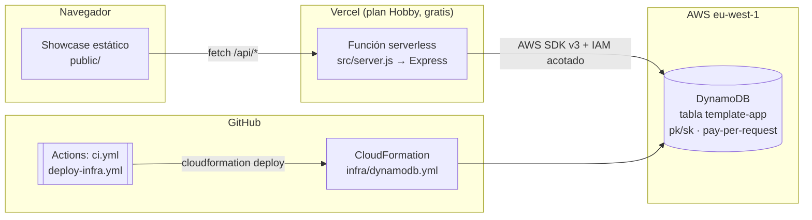

# 🧩 Plantilla: Vercel + Express + DynamoDB

Plantilla **productiva y totalmente funcional** para nuevas apps: un solo repo con frontend
estático, API Express, infraestructura como código (CloudFormation) y CI (GitHub Actions),
desplegable **gratis en Vercel** y conectada a **DynamoDB en tu cuenta AWS**.

La propia app desplegada es un **showcase autoexplicativo**: al entrar en la web ves la
arquitectura con diagramas, el estado en vivo de todas las conexiones (con latencia real a
DynamoDB), una demo CRUD contra la base de datos, la guía de despliegue paso a paso y la
documentación de la API y los tests.

## Arquitectura



**Principios:**

- **Un solo deploy** — Express sirve también el frontend: cero CORS en producción, un pipeline.
- **Fallback sin AWS** — sin credenciales la app corre en "modo memoria". Puedes desplegar y ver
  todo funcionando *antes* de crear la infraestructura; el panel de estado indica el modo activo.
- **Mínimo privilegio** — dos usuarios IAM separados: el de Vercel solo lee/escribe la tabla; el
  del pipeline solo despliega el stack.
- **Single-table design** — una tabla `pk/sk`; el prefijo de `pk` discrimina la entidad
  (`ITEM`, …). Entidad nueva = prefijo nuevo en `src/config/dynamo.js` + un servicio. La infra no cambia.
- **Coste 0 en reposo** — Vercel Hobby + DynamoDB on-demand + Actions gratis.

## Estructura

```
├── src/
│   ├── server.js            # Entry point: exporta app (Vercel) o hace listen (local)
│   ├── app.js               # Express: middleware, estáticos, rutas, errores
│   ├── config/dynamo.js     # Cliente único DynamoDB + prefijos de clave + isDynamoEnabled()
│   ├── routes/              # items (CRUD demo), status (health + conexiones)
│   └── services/            # Lógica: DynamoDB con fallback a memoria
├── public/                  # Showcase (HTML + CSS + JS vanilla, diagramas Mermaid)
├── infra/dynamodb.yml       # CloudFormation: tabla con TTL, PITR y DeletionPolicy: Retain
├── scripts/
│   ├── setup-aws.sh         # Crea usuario IAM runtime (Vercel) acotado a la tabla
│   ├── setup-github-secrets.sh  # Crea usuario IAM deploy y sube secretos con gh
│   └── seed.js              # Registros de ejemplo
├── tests/app.test.js        # node:test contra la app real (modo memoria, sin AWS)
├── .github/workflows/
│   ├── ci.yml               # npm test en cada push/PR (sin secretos)
│   └── deploy-infra.yml     # Despliega el stack cuando cambia infra/** o a demanda
└── vercel.json              # Todo el tráfico → src/server.js (@vercel/node)
```

## Despliegue paso a paso

1. **Local** (sin nada externo):
   ```bash
   npm install && npm test && npm run dev   # http://localhost:3000
   ```
2. **GitHub** — crea el repo **manualmente** (en [github.com/new](https://github.com/new) o con
   `gh repo create usuario/mi-app --public --source . --push`) y haz push. `ci.yml` pasa en verde
   sin secretos.

   > 💡 **Repo de tipo plantilla**: puedes marcar este repo como *Template repository*
   > (Settings → General → Template repository). Los repos generados con "Use this template"
   > copian todo, incluidos los workflows de CI, que funcionan con normalidad. Lo único que
   > **no se copia son los secretos**: en cada repo generado hay que repetir el paso 4
   > (`setup-github-secrets.sh`) y, si quieres tabla propia, cambiar `STACK_NAME`/`TABLE_NAME`
   > en `deploy-infra.yml` para no compartir la misma tabla entre apps.
3. **Vercel** — importa el repo en [vercel.com/new](https://vercel.com/new). Publica ya, en modo memoria.
4. **Infra AWS**:
   ```bash
   ./scripts/setup-github-secrets.sh --profile miperfil --repo usuario/repo
   gh workflow run deploy-infra.yml
   # o a mano: aws cloudformation deploy --template-file infra/dynamodb.yml --stack-name template-app
   ```
5. **Conectar Vercel a la tabla**:
   ```bash
   ./scripts/setup-aws.sh --profile miperfil
   # pega las 4 variables en Vercel → Settings → Environment Variables → redeploy
   ```
6. **Seed opcional**: `cp .env.example .env` (mismas credenciales) y `npm run seed`.

## API

| Método | Ruta | Descripción |
|---|---|---|
| GET | `/api/status/health` | Health check instantáneo |
| GET | `/api/status` | Estado completo: env, runtime, DynamoDB + latencia |
| GET | `/api/items` | Lista registros (100 máx., recientes primero) |
| POST | `/api/items` | Crea registro `{"text": "..."}` |
| DELETE | `/api/items/:id` | Borra registro |

## Tests

`npm test` usa el runner nativo de Node (`node --test`): levanta la app en un puerto efímero y
recorre health, status, el CRUD completo y los errores 400/404, todo en modo memoria — idéntico
en local y en CI.

## Cómo extender la plantilla

1. Añade el prefijo de tu entidad en `KEYS` (`src/config/dynamo.js`).
2. Crea `src/services/tuEntidadService.js` (copia `itemsService.js`: patrón Dynamo + fallback).
3. Crea `src/routes/tuEntidad.js` y móntala en `src/app.js`.
4. Añade tests en `tests/` — corren sin AWS.
5. Si necesitas otra pieza de infra (S3, SQS…), añádela a `infra/`, el workflow la despliega, y
   amplía la política de `scripts/setup-aws.sh` con los permisos mínimos.
