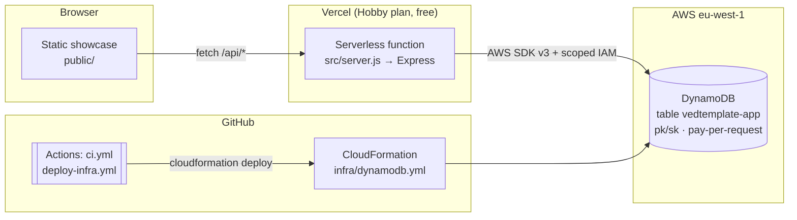

# 🧩 vedtemplate — Template: Vercel + Express + DynamoDB

[](https://github.com/infranettone/infranettone-template-vercel-express-dynamodb/actions/workflows/ci.yml)
**Live demo:** https://vedtemplate.infranettone.com

All the resources of this instance carry the **vedtemplate** prefix: CloudFormation stack and
DynamoDB table `vedtemplate-app`, IAM users `vedtemplate-app-deploy` (pipeline) and
`vedtemplate-app-vercel` (runtime).

A **production-ready, fully functional** template for new apps: a single repo with a static
frontend, an Express API, infrastructure as code (CloudFormation) and CI (GitHub Actions),
deployable **free on Vercel** and connected to **DynamoDB in your AWS account**.

The deployed app is itself a **self-explanatory showcase** and **multilingual (English by default,
Spanish and Mallorcan)**, with these tabs: **Architecture** (diagrams), **📡 Traffic** (a live web
monitoring and visitor-identification tool), **Connections** (real DynamoDB status with latency),
**CRUD demo** against the database, **Deployment** step by step, **🔎 SEO** (a plain-language
explainer) and **API & Tests**. Each tab is hash-linkable (`…/#traffic`), and the chosen language is
remembered in `localStorage`.

## Architecture



**Principles:**

- **Single deploy** — Express also serves the frontend: no CORS in production, one pipeline.
- **No-AWS fallback** — without credentials the app runs in "memory mode". You can deploy and see
  everything working *before* creating the infrastructure; the status panel shows the active mode.
- **Least privilege** — two separate IAM users: the Vercel one only reads/writes the table; the
  pipeline one only deploys the stack.
- **Single-table design** — one `pk/sk` table; the `pk` prefix discriminates the entity
  (`ITEM`, …). New entity = new prefix in `src/config/dynamo.js` + a service. The infra doesn't change.
- **Zero cost at rest** — Vercel Hobby + DynamoDB on-demand + free Actions.

## Structure

```
├── src/
│   ├── server.js            # Entry point: exports app (Vercel) or listens (local)
│   ├── app.js               # Express: middleware (incl. auditing), statics, routes, errors
│   ├── config/dynamo.js     # Single DynamoDB client + key prefixes + isDynamoEnabled()
│   ├── routes/              # items (CRUD), status (health), traffic (monitoring)
│   └── services/            # Logic: DynamoDB with memory fallback
│       ├── itemsService.js
│       ├── statusService.js
│       └── trafficService.js  # Capture, redaction of sensitive values, bots, aggregates
├── public/                  # Showcase (HTML + CSS + vanilla JS, Mermaid diagrams)
│   ├── index.html           # Multilingual showcase (data-i18n keys) + SEO/JSON-LD meta
│   ├── js/main.js           # Tabs, language, status panel, CRUD demo
│   ├── js/i18n.js           # Dictionaries EN (in HTML) + ES + CA (Mallorcan) + tr() helper
│   ├── js/track.js          # Fingerprint beacon (visitor identification)
│   ├── js/traffic.js        # Traffic dashboard (SVG charts)
│   ├── styles/base.css      # Styles (includes the traffic dashboard)
│   ├── favicon.svg
│   └── robots.txt · sitemap.xml · og.svg   # SEO
├── infra/dynamodb.yml       # CloudFormation: table + GSI1, TTL, PITR, deletion protection, Retain
├── scripts/
│   ├── setup-aws.sh         # Creates the runtime IAM user (Vercel) scoped to the table
│   ├── setup-github-secrets.sh  # Creates the deploy IAM user and uploads secrets with gh
│   └── seed.js              # Sample records
├── tests/
│   ├── app.test.js          # node:test: health, status, CRUD, 400/404, frontend
│   └── traffic.test.js      # node:test: sensitive redaction, bots, beacon, aggregates
├── .github/workflows/
│   ├── ci.yml               # npm test on every push/PR (no secrets)
│   └── deploy-infra.yml     # Deploys the stack when infra/** changes or on demand
├── api/index.js             # Serverless entry on Vercel: exports src/app.js
└── vercel.json              # public/ static via CDN; everything else → /api function
```

## Step-by-step deployment

1. **Local** (nothing external):
   ```bash
   npm install && npm test && npm run dev   # http://localhost:3000
   ```
2. **GitHub** — create the repo **manually** (at [github.com/new](https://github.com/new) or with
   `gh repo create user/my-app --public --source . --push`) and push. `ci.yml` passes green
   without secrets.

   > 💡 **Template repository**: you can mark this repo as a *Template repository*
   > (Settings → General → Template repository). Repos generated with "Use this template"
   > copy everything, including the CI workflows, which work normally. The only thing that is
   > **not copied are the secrets**: in each generated repo you must repeat step 4
   > (`setup-github-secrets.sh`) and, if you want your own table, change `STACK_NAME`/`TABLE_NAME`
   > in `deploy-infra.yml` so apps don't share the same table.
3. **Vercel** — import the repo at [vercel.com/new](https://vercel.com/new). It publishes right away, in memory mode.
4. **AWS infra**:
   ```bash
   ./scripts/setup-github-secrets.sh --profile myprofile --repo user/repo
   gh workflow run deploy-infra.yml
   # or manually: aws cloudformation deploy --template-file infra/dynamodb.yml --stack-name vedtemplate-app
   ```
5. **Connect Vercel to the table**:
   ```bash
   ./scripts/setup-aws.sh --profile myprofile
   # paste the 4 variables into Vercel → Settings → Environment Variables → redeploy
   ```
6. **Optional seed**: `cp .env.example .env` (same credentials) and `npm run seed`.

## 100% CLI deployment (the actual flow used for this instance)

This instance was deployed entirely from the terminal, without going through the web UIs except for
two single-click OAuth authorizations. The actual commands, in order:

```bash
# 0) Tools (once)
#    gh:     official binary in ~/.local/bin (no sudo needed) + `gh auth login`
#    vercel: npm install -g vercel  (device-code login on first use)

# 1) GitHub repo (public) marked as template
gh repo create infranettone/infranettone-template-vercel-express-dynamodb \
  --public --source . --push
gh api -X PATCH repos/OWNER/REPO -f is_template=true

# 2) Vercel project + first production deploy
vercel link --yes --project <project-name>
vercel deploy --prod --yes

# 3) Deployment protection is ON by default (the site asks for a Vercel
#    login). Disable it via API to make it public:
#    PATCH https://api.vercel.com/v9/projects/<projectId>?teamId=<teamId>
#    body: {"ssoProtection": null}

# 4) Auto-deploy on every push: install Vercel's GitHub App on the org
#    (the only manual part: https://github.com/apps/vercel) and then:
vercel git connect --yes

# 5) AWS infra: pipeline IAM user + secrets + stack
./scripts/setup-github-secrets.sh --profile <profile> --repo OWNER/REPO
gh workflow run deploy-infra.yml && gh run watch

# 6) Runtime credentials and Vercel variables (without touching the dashboard)
./scripts/setup-aws.sh --profile <profile>
printf 'eu-west-1'        | vercel env add AWS_REGION production
printf 'vedtemplate-app'  | vercel env add DYNAMODB_TABLE production
printf '<KEY_ID>'         | vercel env add AWS_ACCESS_KEY_ID production
printf '<SECRET>'         | vercel env add AWS_SECRET_ACCESS_KEY production --sensitive
vercel redeploy <url-of-last-deploy>

# 7) Custom domain
vercel domains add vedtemplate.infranettone.com
```

**Gotchas learned along the way** (already fixed in the template):

- Node 20 (the one in Actions) doesn't expand globs in `node --test`: use explicit paths.
- Vercel truncates the `*.vercel.app` domain if the project name is too long.
- Vercel sets `AWS_REGION` itself in the runtime; don't rely on it as a configuration signal
  (the status panel checks the credentials, not the region).
- Repos generated from a template **do not inherit the secrets**: repeat step 5.
- Don't use `builds`/`routes` (legacy) in `vercel.json` for an Express app: that builder also
  transpiles the `.js` files in `public/` to CommonJS and breaks the browser's ES modules
  (`require is not defined`). Use `rewrites` + `api/index.js` and leave `public/` as static.

## Traffic monitoring and visitor identification

An analytics tool **built into the app itself** (not an external SaaS). It answers: how many people
visit, who they are, where from, whether they are humans or bots, and whether traffic is growing.
It's shown in the **📡 Traffic** tab of the showcase.

- **Server-side capture**: a middleware records every access (method, path, UA→browser/OS/device,
  geo from Vercel's edge, referrer, bot classification).
- **Visitor identification**: `public/js/track.js` computes a browser *fingerprint* (canvas +
  non-PII signals, hashed with SubtleCrypto) and sends it to `/api/traffic/track`. It lets us count
  uniques and detect returning visitors without a login. It honours `Do-Not-Track`.
- **Bot detection**: a signature in the User-Agent (Googlebot, curl, headless…) + the absence of the
  JS beacon ⇒ confirmed human / unverified / bot / search engine.
- **Time range (AWS-style)**: last hour / 24h / 7d / 30d / 90d / 1y / custom `[from,to]`. On
  DynamoDB it's a sort-key `BETWEEN` Query, so narrowing the range narrows the scan (scales).
- **Row limit** (100–2000) tied to the range; when reached the UI shows a "capped" note so a
  million-row table never overloads the page. Adaptive series buckets (hourly/daily/monthly).
- **Filter, sort, paginate, export**: filter the feed (all/humans/bots) and free-text search;
  click any column to sort; paginate both tables; export the current view to CSV/JSON. Optional
  "Live" auto-refresh (off by default — it only reads, never simulates) with a customizable
  interval and a "Reset defaults" button. Range/limit/Live prefs persist in `localStorage`.
- **Collapsible sections**: every section title collapses/expands (chevron), with "Collapse all"
  / "Expand all" under the tabs; collapsed state is remembered in `localStorage` too.
- **World map + country filter**: bubbles at country centroids; click one (or a Top-Country bar)
  to filter the whole dashboard by country. At scale this is served by a **GSI** (`gsi1pk =
  "C#<country>"`), so a country query reads only that country's key range.
- **Trend**: momentum within the selected range (recent half vs earlier half).
- **Privacy by design** (the site is public): sensitive request/response values (Authorization,
  cookies, query strings) are **captured for auditing but never stored or shown in clear**. The IP
  is stored masked (last octet dropped) and with a salted hash to count uniques without revealing
  the address. Tests guarantee they aren't leaked.
- **Demonstrable**: `POST /api/traffic/simulate` injects varied synthetic traffic to see the
  dashboard live without waiting for real visits.

Storage (single-table): `EVENT` (one access, TTL 7 days) and `VISITOR` (profile per fingerprint).
Aggregates are computed on read, so there are no rollups to drift out of sync. The table has
**deletion protection** enabled and one **GSI** (`GSI1`) for country-scoped queries.

## SEO

The template ships with on-page SEO ready: descriptive `<title>` and meta description, Open Graph/
Twitter cards, canonical URL, **structured JSON-LD data** (Organization + Person +
SoftwareApplication), `robots.txt` and `sitemap.xml`. The **🔎 SEO** tab of the showcase explains in
plain language how a search engine works (crawl → index → rank) and what the template does for you.

## API

| Method | Path | Description |
|---|---|---|
| GET | `/api/status/health` | Instant health check |
| GET | `/api/status` | Full status: env, runtime, DynamoDB + latency |
| GET | `/api/items` | List records (100 max, newest first) |
| POST | `/api/items` | Create record `{"text": "..."}` |
| DELETE | `/api/items/:id` | Delete record |
| GET | `/api/traffic` | Aggregated dashboard (KPIs, series, tops, redacted feed) |
| GET | `/api/traffic/visitors` | Identified visitors |
| POST | `/api/traffic/track` | Fingerprint beacon (called by `track.js`) |
| POST | `/api/traffic/simulate` | Injects synthetic traffic for the demo |

## Tests

`npm test` uses Node's native runner (`node --test`, zero dependencies), boots the real app on an
ephemeral port and runs **19 tests** in memory mode — identical locally and in CI:

- `tests/app.test.js` — health, status, full CRUD, 400/404 errors, and that the frontend is served.
- `tests/traffic.test.js` — IP masking, User-Agent parsing, bot classification, the beacon flow,
  dashboard aggregates and, above all, that **sensitive values are never leaked** (neither in the
  stored event nor in the public redacted view).

> Note: memory mode does not exercise DynamoDB `UpdateExpression`s, so Dynamo syntax errors only
> surface in production. To test against real DynamoDB, start DynamoDB Local and export
> `DYNAMODB_ENDPOINT` + dummy credentials.

## How to extend the template

**Add a new entity/service:**

1. Add your entity prefix to `KEYS` (`src/config/dynamo.js`).
2. Create `src/services/yourEntityService.js` (copy `itemsService.js`: Dynamo + fallback pattern).
3. Create `src/routes/yourEntity.js` and mount it in `src/app.js`.
4. Add tests in `tests/` — they run without AWS.
5. If you need another piece of infra (S3, SQS…), add it to `infra/`, the workflow deploys it, and
   extend the `scripts/setup-aws.sh` policy with the minimum permissions.

**Add a new tab or text in the showcase:** write the text in English in `index.html` with a
`data-i18n="my.key"` attribute (or `data-i18n-placeholder`), and add `my.key` to the `es` and `ca`
dictionaries in `public/js/i18n.js`. English lives in the HTML; the other languages are applied by
overwriting `innerHTML`. JS-generated strings use `tr(lang, key)` with the keys in `jsDefaults`.
